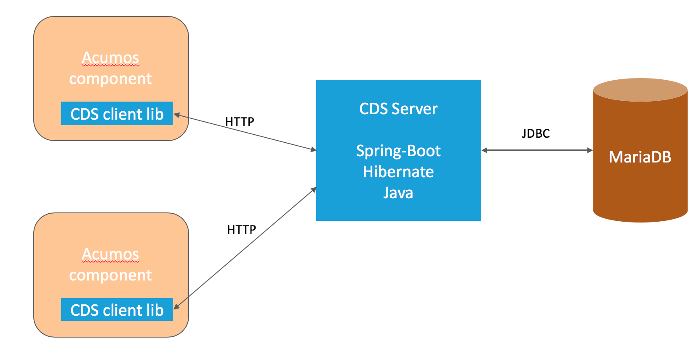

.. ===============LICENSE_START=======================================================
.. Acumos CC-BY-4.0
.. ===================================================================================
.. Copyright (C) 2017 AT&T Intellectual Property & Tech Mahindra. All rights reserved.
.. ===================================================================================
.. This Acumos documentation file is distributed by AT&T and Tech Mahindra
.. under the Creative Commons Attribution 4.0 International License (the "License");
.. you may not use this file except in compliance with the License.
.. You may obtain a copy of the License at
..
.. http://creativecommons.org/licenses/by/4.0
..
.. This file is distributed on an "AS IS" BASIS,
.. WITHOUT WARRANTIES OR CONDITIONS OF ANY KIND, either express or implied.
.. See the License for the specific language governing permissions and
.. limitations under the License.
.. ===============LICENSE_END=========================================================

============================
Common Data Service Overview
============================

The Acumos Common Data Service provides a storage and query layer between Acumos system
components and a relational database.
The server component is a Java Spring-Boot application that provides REST service to callers
and uses Hibernate to manage the persistent store.
The client component is a Java library that provides business objects (models) and
methods to simplify the use of the REST service.

Architecture
------------

The following picture shows how the service components are used by other Acumos components.
The client uses HTTP/REST to communicate with the server.  The server uses JDBC to communicate
with the database.

Developer Resources
-------------------
The source is available from the Linux Foundation Gerrit server:
 
    `<https://gerrit.acumos.org/r/gitweb?p=common-dataservice.git;a=summary>`_

The build (CI) jobs are in the Linux Foundation Jenkins server:

    `<https://jenkins.acumos.org/view/common-dataservice/>`_

Issues are tracked in the Linux Foundation Jira server:

    `<https://jira.acumos.org/secure/Dashboard.jspa>`_

Project information is available in the Linux Foundation Wiki:

    `<https://wiki.acumos.org/>`_
